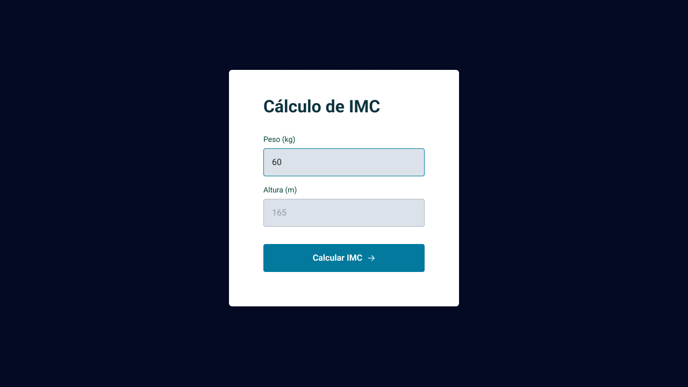

<h1 align="center"> Cálculo do IMC </h1>

Programa de formação Explorer, promovido pela Rocketseat para ensino de tecnologias WEB.  

  <a href="#🚀-tecnologias">Tecnologias</a>&nbsp;&nbsp;&nbsp;|&nbsp;&nbsp;&nbsp;
  <a href="#💻-projeto">Projeto</a>

  
  

 

## 🚀 Tecnologias

Esse projeto foi desenvolvido com as seguintes tecnologias:

    
    
    
    
    
    

 

## 💻 Projeto

O calculateIMC é um projeto que faz o calculo do índice da massa corporal.

- [Acesse o projeto finalizado, online](https://salasfernando.github.io/calculateIMC/)